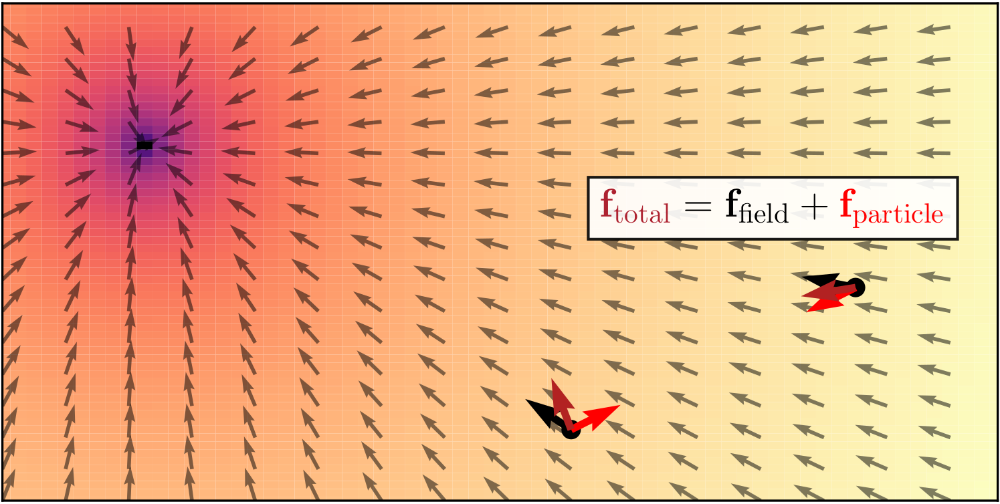

### TL;DR: Field discovery in interacting systems

We discover global fields in interacting systems, inferring them from the dynamics alone, using neural fields.

**_Aether_**, the medium that permeates all throughout space and allows for propagation of light. :dash: :ocean: :rock: :fire:

__Keywords__:
Graph Neural Networks, Neural Fields, Field Discovery, Equivariance, Interacting Dynamical Systems, Geometric Graphs

### Introduction -- Interacting systems are everywhere...

---

| Colliding particles | N-body systems | Molecules | Traffic scenes |
|:---:|:---:|:---:|:---:|
| Gravitational System  | Trajectron Scene  |

---

- Colliding particles
- N-body systems
- Molecules
- Traffic scenes


### ... but they do not evolve in a vacuum

---

|  |  |
|:---:|:---:|
| *Figure credit: \cite{eht2019m87}* | *Figure credit: \cite{nuscenes}* |

---

- Electromagnetic fields
- Gravitational fields
- "Social" fields
  - Road network
  - Traffic rules

### Related work -- Equivariant graph networks

Strictly equivariant graph networks exhibit increased robustness and performance, while maintaining parameter efficiency due to weight sharing.

|  |  |  |
|:---:|:---:|:---:|
| EGNN | LoCS | SEGNN |

However, they are **incompatible** with global field effects.

### Motivation -- Entangled equivariance

Object interactions depend on local information, while underlying field effects depend on global states. Interactions are equivariant to a group of transformations; field effects are not.



We only observe the net effect of the two constituents. We refer to this as *entangled equivariance*.

### Background -- Neural fields primer


- **Grid:**
  

- **MLP:**
  

- **Neural Field:**
  

### Background -- Equivariant graph network backbone


- **Node Features:**
  - Positions: $ \mathbf{p}_i $
  - Velocities: $ \mathbf{u}_i $
  - Orientations: $ \mathbf{\omega}_i $ (for $R\mathbf{v}_i$)

- **Message Passing:**
  - Local-to-Global Transformation: $ \mathbf{v}_{j|i} = \textsc{Global2Local}(\mathbf{v}_{j}, \mathbf{v}_{i}) $
  - GNN Computation: $ \bm{\Delta}\mathbf{x}_{i|i} = \textrm{GNN}(\mathbf{v}_{i|i}, \{\mathbf{v}_{j|i}\}_{j \in \mathcal{N}(i)}) $
  - Local-to-Global Transformation: $ \bm{\Delta}\mathbf{x}_i = \textsc{Local2Global}(\bm{\Delta}\mathbf{x}_{i|i}) $

- **Node Update:**
  \[ \mathbf{\hat{x}}_i = \mathbf{x}_{i} + \bm{\Delta}\mathbf{x}_i \]

### Method -- Aether Architecture

We model object interactions with equivariant graph networks [@kofinas2021roto], and field effects with neural fields. We hypothesize that field effects can be attributed to force fields, and therefore, our neural fields learn to discover latent force fields.


*Figure 1: Latent Neural Field*


*Figure 2: Aether pipeline*

The pipeline of our method, *Aether*. In the latent neural field (Figure 1), a graph aggregation module summarizes the input trajectories in a latent variable $\mathbf{z}$. Query states from input trajectories, alongside $\mathbf{z}$, are fed to a neural field that predicts a latent force field. In the Aether pipeline (Figure 2), a graph network integrates predicted forces with input trajectories to predict future trajectories. The graph aggregation module and the FiLM layers exist only in a dynamic field setting.

**Graph Aggregation and Integration Equations:**

```latex
\begin{columns}
  \begin{column}{0.50\textwidth}
    {\footnotesize
      \begin{align*}
        \mathbf{h}_{j,i}^{(1)} &= f_{e}^{(1)}\left(\left[\mathbf{v}_{j|i}, \highlight{\mathbf{f}_{j|i}}, \mathbf{v}_{i|i}, \highlight{\mathbf{f}_{i|i}}\right]\right) \\
        \mathbf{h}_i^{(1)} &= f_v^{(1)}\left(g_v \left(\left[\mathbf{v}_{i|i}, \highlight{\mathbf{f}_{i|i}}\right]\right) + \frac{1}{|\mathcal{N}(i)|}\smashoperator[r]{\sum_{j \in \mathcal{N}(i)}} \mathbf{h}_{j,i}^{(1)}\right)
      \end{align*}
    }
  </end{column}
  \begin{column}{0.50\textwidth}
    {\footnotesize
      \begin{align*}
        \mathbf{h}_{j,i}^{(l)} &= f_e^{(l)}\left(\left[\mathbf{h}^{(l-1)}_i, \mathbf{h}^{(l-1)}_{j,i}, \mathbf{h}^{(l-1)}_j\right]\right) \\
        \mathbf{h}_{i}^{(l)} &= f_v^{(l)}\left(\mathbf{h}_{i}^{(l-1)} + \frac{1}{|\mathcal{N}(i)|}\smashoperator[r]{\sum_{j \in \mathcal{N}(i)}} \mathbf{h}_{j,i}^{(l)}\right) \\
        \mathbf{\hat{x}}_i &= \mathbf{x}_i + \mathbf{R}_i \cdot f_o\left(\mathbf{h}_i^L\right)
      \end{align*}
    }
  \end{column}
\end{columns}
```

### Visualizations


